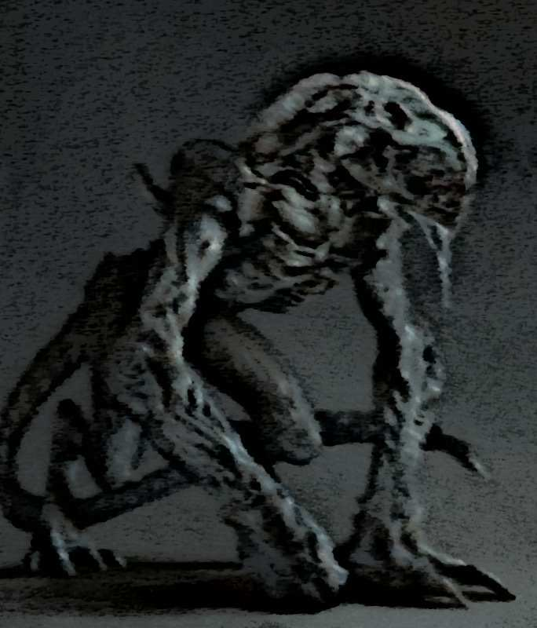

# Yazghur (Jazghur)

*description: A description of the beast from the words of the living, the notes of the dead, and the legends of our ancestors.*
*category: descriptions and definitions*
*tags: creatures, shadow, predator*

---

<figure><cite>Sketch of the Yazghur, drawn from survivor accounts.</cite></figure>

* [Description](#description)
* [Origin](#origin)
* [Behavior](#behavior)

<figure>
    <blockquote>
        
In vain does one seek among the known realms a beast so synonymous with the
        threat whispered through the darkness of night, so woven with the chill of a
        thousand icy threads piercing the flesh, as the creature called the Yazghur.

        <footer>
            <cite>— Wynn Growfield, Called the Bold</cite>
        </footer>
    </blockquote>
</figure>

## Description

No living soul should doubt the existence of these creatures. Even considering that
descriptions given to them over hundreds of years number in the hundreds and differ
from one another considerably. all, however, agree on one thing: the Yazghur are
foul creatures of shadow. They know no mercy, can attack in packs or alone, and
above all else, they revel in darkness.

Their bodies are described as black masses of muscle, bone, and claws. In some
tales and accounts, their skin is moist and glistening in moonlight or torchlight,
while in others it is dried and rough. Their eyes do not glow with their own light,
but catch and reflect what little illumination exists—a cold, sudden gleam in the
dark that vanishes as quickly as it appears. A victim's last sight is often just
that: a flash of reflected moonlight, there and gone. They walk on four legs, with the forelimbs
possessing remarkable strength, though they have also been seen standing on their
hind legs—usually when listening, but sometimes while moving about. They climb
superbly and, to make matters worse, can jump incredible distances. Fortunately, most
accounts agree that these are massive creatures, and as such can be overcome if
driven into narrow passages or corridors. Yet one must not seal them in for long, as
many accounts assure us they can quickly burrow tunnels dozens of feet long—if
given sufficient time.

## Origin

Due to their rare occurrence and lack of well-known lairs, it is difficult to
specify the original origin of these creatures. Nevertheless, searching through
records and tales for certain patterns, and excluding the claims that these
beasts are born from darkness itself, one could conclude that given their nature
and hatred of light, the Yazghur are born, live, and die deep underground. Over
the centuries, they have been encountered—aside from deep caves, of course—also
in abandoned dungeons and catacombs.

## Behavior

What is known of the Yazghur's behavior comes almost entirely from accounts of
survivors and the silence left by those who did not survive. They are solitary
hunters by preference, yet capable of forming loose packs when territory or prey
demands it. A lone Yazghur is dangerous; a pair is deadly; a pack is a nightmare
spoken of in hushed voices around dying campfires.

Their hunting grounds are places of darkness—cellars, ruins, mineshafts, the
deep places beneath cities. They do not chase prey over long distances. Instead,
they wait. They watch. They listen. And when their target is cornered, exhausted,
or simply unaware, they strike with terrible speed. The accounts of survivors
describe the same pattern: a sudden weight, the rending of claws, and then
darkness.

Yazghur do not eat their prey immediately. They drag the bodies to their lairs,
to their tunnels, to the deepest dark they can find. It is unknown whether this
is habit, instinct, or something more deliberate. Some scholars believe they
cache food for later consumption. Others whisper that they are not eating at
all—that something else is happening in those tunnels, something that leaves
bones clean and arranged in patterns no beast would make.

They fear light, this is certain. A torch, a lantern, even a sliver of
moonlight in a shaft—all drive them back, buy precious seconds. But fire alone
will not save you. The Yazghur have been known to circle, to wait, to let the
fuel run out. They are patient beyond measure, and they do not forget.

Most terrifying of all are the sounds. Those who have heard a Yazghur's call
describe it not as a roar or a growl, but as a whisper—a voice that seems to
come from everywhere and nowhere, from the walls themselves, from the dark
behind your eyes. Some say it speaks words. Others say it is worse than words.
None who heard it were ever quite the same afterward.
